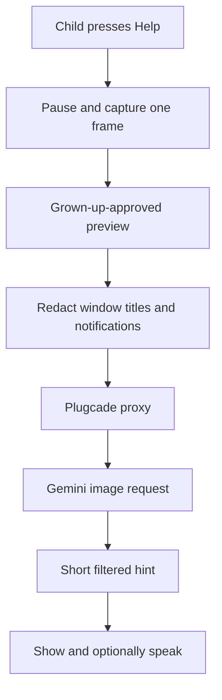

# Plugcade Help Buddy: privacy-first design

## Current status

Plugcade Core 0.4 does **not** watch the screen, record gameplay, connect to an
AI service, or send data over the internet. Kid Mode uses local cover images,
plain-text `help.txt` cards, keyboard navigation, and Windows speech when it is
available.

## Why the AI helper is separate

Plugcade is offline-first and intended for children and old computers. A cloud
assistant that sees gameplay would change all three parts of that promise: it
needs internet access, it can cost money, and a screenshot may contain a child's
name, chat, notifications, save-file names, or other private information.

The Gemini API can accept image inputs, so a manually captured game frame could
eventually be used to explain an on-screen puzzle. That capability belongs in an
optional helper for modern Standard editions, not in the Legacy/Core launcher.

## Non-negotiable requirements

1. Disabled by default and absent from Kid Mode until a grown-up enables it.
2. No continuous recording, background capture, webcam, or microphone access.
3. A visible preview shows the exact frame and question before anything is sent.
4. The child can ask only through a simple Help action; there is no open chat box.
5. Requests use the most restrictive practical safety configuration.
6. Answers are short, age-appropriate hints that avoid spoilers when possible.
7. Captures are deleted locally after the answer unless a grown-up saves one.
8. The launcher never stores an API key. A local or hosted proxy owns the key.
9. Usage limits, an off switch, and an activity log are available to grown-ups.
10. The helper never downloads games, patches, cheats, or unknown executables.

## Proposed request flow

## Key handling

Google's current Gemini guidance says API keys should be treated like passwords,
must not be committed to source control, and should not be embedded in client-side
applications. The Standard helper therefore requires a proxy. A raw key in
`settings.ini`, the HTA, or a downloadable executable is not an acceptable design.

## Before implementation

- Complete a child-safety and privacy review.
- Decide whether the proxy is self-hosted, community-hosted, or supplied by each
  family; never make the maintainer silently pay for public API use.
- Build a fixed evaluation set of real game screens, including text-heavy,
  flashing, dark, and misleading scenes.
- Test refusals, hallucinations, spoilers, cost limits, and loss of connectivity.
- Publish a plain-language data notice before the feature is enabled for anyone.

Reference documentation:

- [Gemini image understanding](https://ai.google.dev/gemini-api/docs/image-understanding)
- [Gemini API key security](https://ai.google.dev/gemini-api/docs/api-key)
- [Gemini safety settings](https://ai.google.dev/gemini-api/docs/safety-settings)
